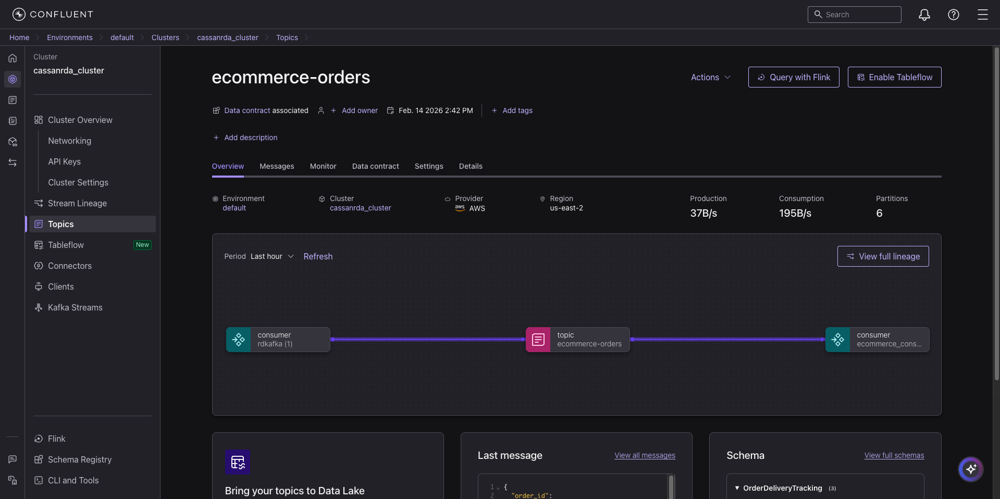
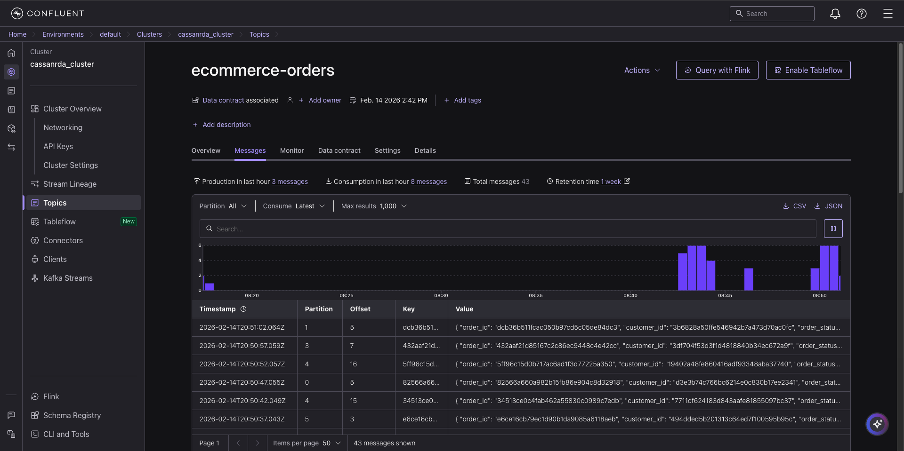
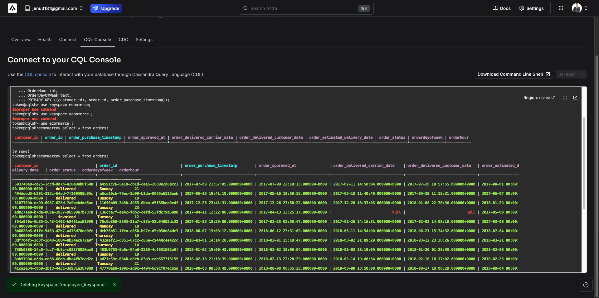

# E-Commerce Data Pipeline: Kafka to Cassandra

The objective is to implement a robust real-time data pipeline that streams e-commerce order data from a CSV source, processes it through a Kafka cluster (using Confluent Cloud), and sinks it into a Cassandra database (using DataStax Astra DB).

## Pipeline Overview

The pipeline consists of two main Python components:

1.  **Producer (`kafka_producer.py`)**: Reads order data, serializes it using Avro, and pushes it to a Kafka topic.
2.  **Consumer (`kafka_consumer.py`)**: Consumes the Avro messages, transforms the data (timestamp conversion, UUID casting), and inserts it into a Cassandra database.

### Architecture

The flow of data is as follows:
`CSV Data` -> `Kafka Producer` -> `Confluent Cloud (Kafka Topic)` -> `Kafka Consumer` -> `Astra DB (Cassandra)`



## Prerequisites

- **Python 3.x**
- **Confluent Cloud Account**: For Kafka Cluster and Schema Registry.
- **DataStax Astra DB Account**: For serverless Cassandra database.
- **Secure Connect Bundle**: Downloaded from Astra DB (`secure-connect-cassandra.zip`).

## Setup & Installation

1.  **Install Dependencies**:

    ```bash
    pip3 install pandas confluent_kafka python-dotenv certifi httpx authlib cachetools attrs fastavro cassandra-driver
    ```

2.  **Environment Variables**:
    Create a `.env` file with the following configurations:

    ```env
    KAFKA_BOOTSTRAP_SERVERS=<your_bootstrap_servers>
    KAFKA_SASL_USERNAME=<your_api_key>
    KAFKA_SASL_PASSWORD=<your_api_secret>
    SCHEMA_REGISTRY_URL=<your_schema_registry_url>
    SCHEMA_REGISTRY_AUTH=<your_schema_registry_auth_info>
    CASSANDRA_CLIENT_ID=<your_astra_client_id>
    CASSANDRA_SECRET=<your_astra_client_secret>
    ```

3.  **Cassandra Bundle**:
    Ensure `secure-connect-cassandra.zip` is in the project root.

## Components

### 1. Kafka Producer (`kafka_producer.py`)

The producer reads the `olist_orders_dataset.csv` file. It uses the `confluent_kafka` library to serialize data into Avro format based on the schema defined in `avro_schema.json`.

**Key Features:**

- **Schema Registry Integration**: Fetches the latest schema for `ecommerce-orders-value` to ensure data compatibility.
- **Avro Serialization**: Efficiently serializes message values.
- **Combined Key Strategy**: (See "Challenges Faced" below).



### 2. Kafka Consumer (`kafka_consumer.py`)

The consumer subscribes to the `ecommerce-orders` topic. It deserializes the Avro messages and prepares them for insertion into Cassandra.

**Key Features:**

- **Data Transformation**:
  - Converts string UUIDs to Python `uuid.UUID` objects.
  - Parses timestamp strings into Python `datetime` objects.
  - Derives new fields: `OrderHour` and `OrderDayOfWeek`.
- **Cassandra Insertion**: Uses a prepared statement with `ConsistencyLevel.QUORUM` for reliable writes.



## Schema

The data conforms to the Avro schema defined in `avro_schema.json`:

- **Namespace**: `com.mycorp.order`
- **Name**: `OrderDeliveryTracking`
- **Fields**: `order_id`, `customer_id`, `order_status`, various timestamps.

## Challenges Faced: Producer Key Strategy

### The Challenge

One of the critical decisions in designing a Kafka producer is selecting the Message Key.

- **Ordering**: Kafka guarantees ordering only _within a partition_. Messages with the same key go to the same partition.
- **Uniqueness**: We needed a way to uniquely identify records while also ensuring a good distribution across partitions if we scaled up.
- **Business Logic**: Queries might need to look up orders by `order_id` or `customer_id`.

### The Solution: Combined Key

In `kafka_producer.py`, we implemented a **Combined Key** strategy:

```python
# kafka_producer.py Line 53
k = f"{row['order_id']}-{row['customer_id']}"
```

**Why this approach?**

1.  **High Cardinality**: Combining `order_id` and `customer_id` creates a highly unique key. This prevents "hot partitions" where one partition gets overwhelmed with too much data (which might happen if we keyed only by a low-cardinality field like `order_status`).
2.  **Traceability**: Debugging is easier because the key itself carries two critical pieces of business information. If a record fails (as seen in the `delivery_report` callback), we immediately know _which_ order and _which_ customer are affected without parsing the value.
3.  **Future Proofing**: If the downstream consumer logic changes to require aggregation by specific customer-order pairs, the data is already keyed appropriately.

**How it was addressed in code:**
We strictly enforced this string format before producing the message. The `StringSerializer('utf_8')` was used for the key, while the value remained a structured Avro object.
