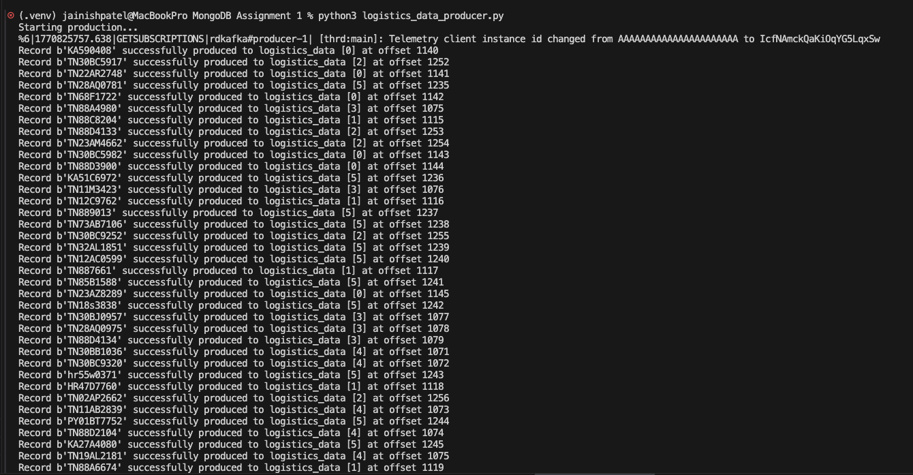
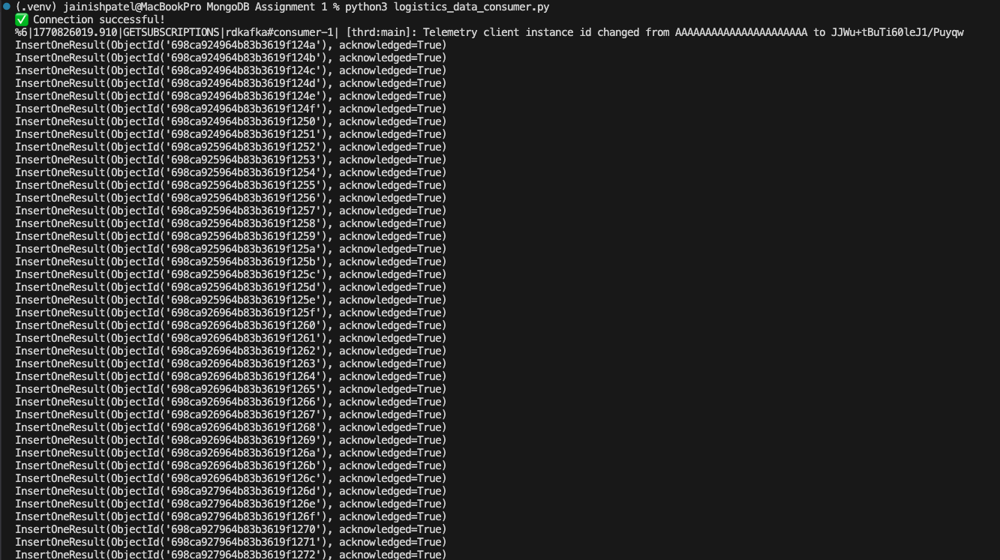
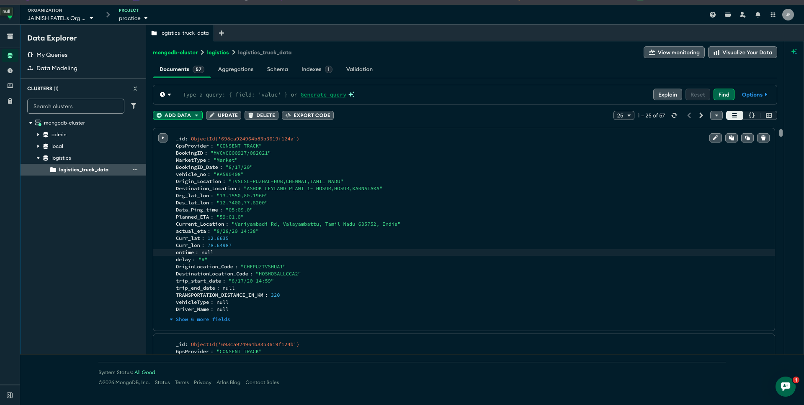
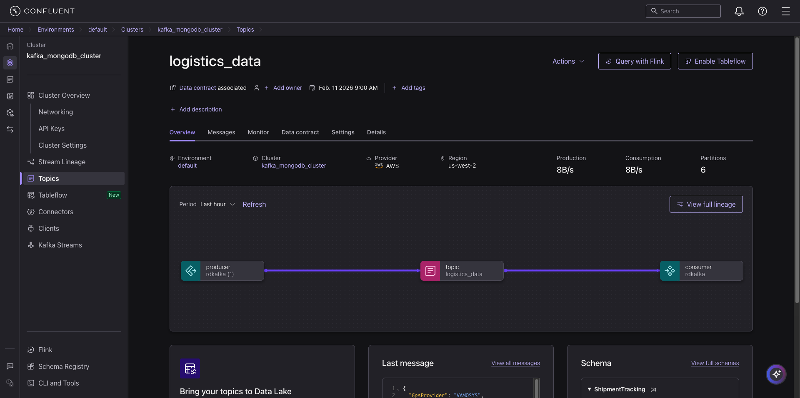
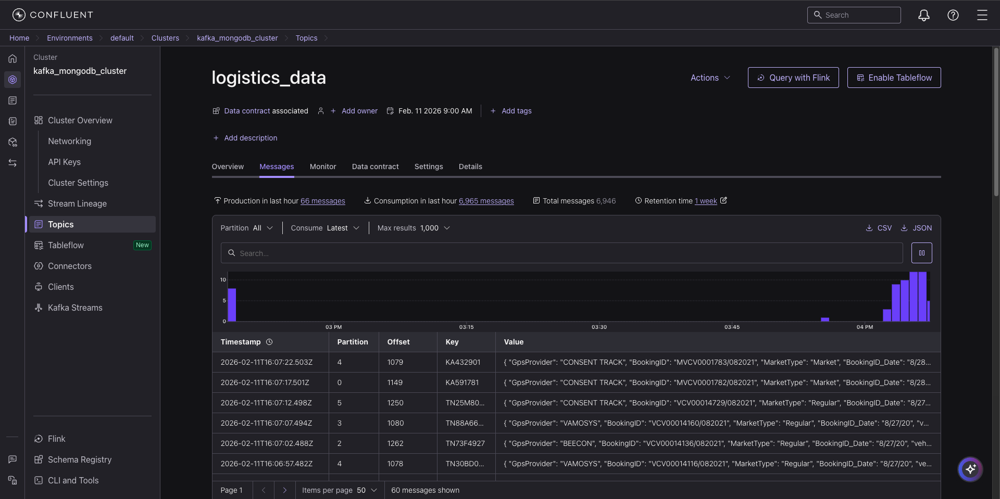

# MongoDB Assignment: Logistics Data Pipeline

This project demonstrates a data engineering pipeline integrating **Kafka** (Confluent Cloud) and **MongoDB** (Atlas) using **Python**. It includes a Kafka Producer, a Kafka Consumer that ingests data into MongoDB, and a FastAPI-based REST API to query and analyze the stored logistics data.

## Project Structure

- `logistics_data_producer.py`: Reads CSV data, serializes it using Avro, and publishes to a Kafka topic.
- `logistics_data_consumer.py`: Consumes Kafka messages, deserializes Avro data, validates/cleans it, and inserts it into MongoDB.
- `logistics_api.py`: FastAPI application providing endpoints for querying and analyzing the data.
- `delivery_trip_truck_data.csv`: Input dataset.


## Execution Instructions

### 1. Run the Kafka Producer
The producer reads from `delivery_trip_truck_data.csv`, cleans the data (handling NULLs and numeric conversions), and sends Avro-serialized messages to the `logistics_data` topic.



```bash
python logistics_data_producer.py
```
*Note: The producer sends messages with a 5-second delay to simulate real-time data flow.*

### 2. Run the Kafka Consumer
The consumer subscribes to the `logistics_data` topic, deserializes the messages using the Schema Registry, applies business logic (status calculation), and inserts documents into the `logistics_truck_data` collection in MongoDB.



```bash
python logistics_data_consumer.py
```

### 3. Run the API Server
Start the FastAPI server to expose the data via REST endpoints.



```bash
uvicorn logistics_api:app --reload
```
Access the interactive API documentation at: `http://127.0.0.1:8000/docs`

## Confluent Cloud & MongoDB Setup



## API Endpoints

The API provides the following analytics and retrieval functions:

-   **GET /trips**: Filter trips by status (e.g., 'Delayed'), vehicle number, or GPS validity.
-   **GET /analytics/supplier-stats**: Aggregates average trip distance and total trips per supplier.
-   **GET /analytics/delay-intensity-analysis-stats**: Identifies bottleneck routes by calculating delay percentages.
-   **GET /analytics/fleet-efficiency**: Analyzes efficiency (distance, trip count) for 'Market' vs. 'Owned' vehicles.

## Process Flow & Assumptions

### Data Ingestion (Producer)
-   **Validation**: The script checks against `SCHEMA_FIELDS` to avoid "extra field" errors.
-   **Null Handling**:
    -   Fields defined as `string` in Avro (e.g., `GpsProvider`, `BookingID`) are replaced with "Unknown" if null, as Avro strings cannot be null.
    -   Optional fields (union `["null", "string"]`) are explicitly set to `None`.
-   **Key Selection**: Uses `vehicle_no` as the message key to ensure strict ordering of events for a specific vehicle within a partition.

### Data Processing (Consumer)
-   **Schema Registry**: The consumer fetches the latest schema (`logistics_data-value`) dynamically to deserialize messages.
-   **Data Transformation**:
    -   **GPS Validation**: Assumes coordinates `(0.0, 0.0)` represent invalid GPS data. Sets `gps_valid = False` and nullifies the coordinates.
    -   **Status Logic**:
        -   If `ontime == 'G'`, status is set to **'On Time'**.
        -   If `delay == 'R'`, status is set to **'Delayed'**.
        -   Otherwise, status is **'Unknown'**.
    -   Basic nulls ("Unknown" strings from producer) are converted back to Python `None` for cleaner database storage.

### API logic
-   **Aggregation**: Uses MongoDB Aggregation Framework for high-performance calculations (delays, averages) rather than processing in Python.
-   **Async**: Uses `motor` for non-blocking database queries.
